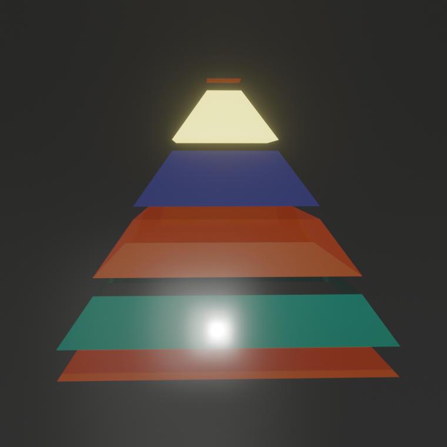

# ⚸ 🔆[DecentSubscriptions](https://TheJollyLaMa.github.io/DecentSubscriptions/public)



A Decent, Simple, Smart Subscriber button

---

## 🛠️ **Tech Stack**

- **Frontend**: HTML, CSS, JavaScript
- **Blockchain**: Polygon
- **Smart Contracts**: Solidity
- **Wallet Integration**: ethers.js

---

## 🚀 **How to Fork and Run Locally**

### 1. Fork the Repository

1. Navigate to the [GitHub repository](https://github.com/TheJollyLaMa/DecentSubscriptions).
2. Click the **Fork** button in the top-right corner to create your copy.

### 2. Clone to Your Local Environment

1. Copy the forked repo URL (use the green "Code" button > HTTPS or SSH).
2. Open your terminal and run:
   ```bash
   git clone <repo-url>
   cd DecentSubscriptions
    ```
### 3. Install Dependencies
    This project does not require package installations as it is a simple HTML/CSS/JS application. However, you need a local HTTP server to run it.

### 4. Start a Local Server
    If you have Python installed, you can quickly start a server with:
    
    python -m http.server public

    Then, open your browser and go to http://localhost:8000.

    Alternatively, you can use any other HTTP server like Node.js or VS Code Live Server.
    npx http-server public

## 🖌️ How to Make CSS Changes
	1.	Open the styles.css file in the public/ folder.
	2.	Find the section you’d like to modify. For example, to update the subscription button’s glow effect, look for:
.subscription-button:hover {
box-shadow: 0 0 30px #0f0, 0 0 60px #0f0, 0 0 90px #0f0;
}
	3.	Save the file and refresh your browser to see the changes.

## 📦 Deploying Your Own Version

### 1. Setup GitHub Pages
	1.	Navigate to your forked repository on GitHub.
	2.	Go to Settings > Pages.
	3.	Under Source, select the main branch and click Save.

Your site will be live at https://<your-username>.github.io/DecentSubscriptions/public.

### 2. Deploy Your Own Contract
	1.	Open Remix.
	2.	Create a new file called DecentSubscription.sol and paste the contract code from contracts/.
	3.	Compile the contract using the Solidity compiler.
	4.	Deploy the contract to the Polygon network using a connected wallet (like MetaMask).

### 3. Update the Frontend
	1.	After deploying, copy your contract address.
	2.	Open contract.js in the public/scripts/ folder.
	3.	Replace the contractAddress variable with your new contract address:
const contractAddress = “”;
	4.	Save your changes, and your dApp will now interact with your own contract.

### ⚠️ Disclaimer

This project is experimental and intended for educational purposes only. It is not guaranteed to work as intended or be secure for production use. Please do your own due diligence before using or deploying any smart contracts, applications, or blockchain-related projects. The creators of this project take no responsibility for any losses or damages incurred. Use at your own risk.

### ⚡ Features
	•	Connect with MetaMask to manage your subscription.
	•	Check your subscription history, including timelines and status.
	•	Easily update subscription fees as the contract owner.
	•	Withdraw accumulated subscription fees directly from the dApp.

### 📚 Learn More

## 🔗 Links
	•	Polygon Network
	•	ethers.js Documentation
	•	Remix Solidity IDE

## 🧾 License

This project is licensed under the MIT License.

Enjoy a decent subscription experience with ⚸ DecentSubscriptions ⸬!

## ⚸📜 [The Contract](https://polygonscan.com/address/0x8C6E80B510216840f4eFf18D6d2A9bD81f38e6CC#events)

* another Decent Realization by TheJollyLaMa 